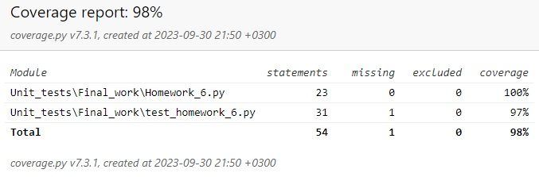

## Объяснение покрытых тестами сценариев

1. **Тестирование расчета среднего значения (test_calculate_average)**:
   - Этот тест проверяет правильность расчета среднего значения для двух списков.
   - Выбран, чтобы убедиться, что функция `calculate_average` корректно вычисляет среднее значение для заданных списков.   
2. **Тестирование сравнения средних значений (test_compare_average)**:
   - Эти тесты проверяют, как функция `compare_average` сравнивает средние значения двух списков и возвращает соответствующее сообщение.
   - Тесты включают сценарии, когда первый список имеет большее, второй список имеет большее и когда средние значения равны.
   - Выбраны для обеспечения корректности работы функции при различных случаях сравнения.
3. **Тестирование пустых списков (test_empty_lists)**:
   - Этот тест проверяет, как функция `compare_average` обрабатывает случай, когда оба входных списка пусты.
   - Выбран, чтобы убедиться, что функция может корректно обрабатывать пустые списки и возвращать сообщение о равенстве средних значений.
4. **Тестирование одного пустого списка (test_one_empty_list)**:
   - Этот тест проверяет, как функция `compare_average` обрабатывает случай, когда один из списка пуст, а другой нет.
   - Выбран, чтобы удостовериться, что функция правильно определяет, что непустой список имеет большее среднее значение.
5. **Тестирование списков с отрицательными числами (test_negative_numbers)**:
   - Этот тест проверяет, как функция `compare_average` обрабатывает случай, когда оба списка содержат отрицательные числа.
   - Выбран, чтобы проверить, что функция правильно сравнивает средние значения в таких случаях.
6. **Тестирование обработки ошибки TypeError (test_invalid_input)**:
   - Этот тест проверяет, как функция `validate_lists` обрабатывает случай, когда входные списки содержат невалидные данные.
   - Выбран, чтобы удостовериться, что функция корректно обнаруживает и обрабатывает ошибки в данных.

Эти сценарии были выбраны для тестирования, потому что они покрывают различные аспекты работы класса `ListComparator` и позволяют убедиться в правильности его функционирования в разных ситуациях. Тестирование пустых списков, отрицательных чисел и обработки ошибок также помогает улучшить надежность кода и убедиться, что он работает корректно даже в граничных случаях.

### Отчёт о покрытии тестами:
